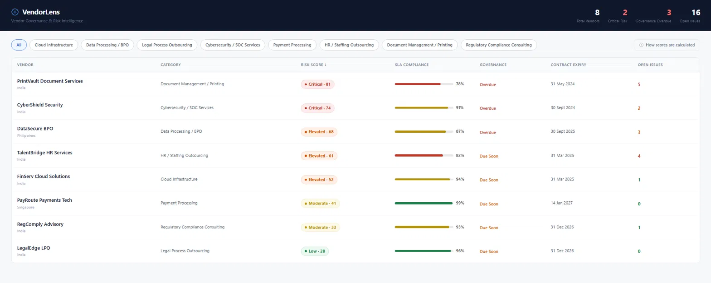
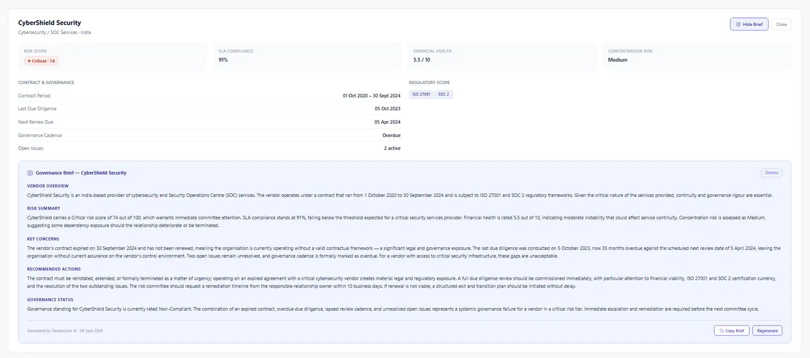

# VendorPulse

**Vendor Governance & Risk Intelligence Dashboard**

A working AI-assisted tool that scores vendor risk across six dimensions, tracks governance cadence, and generates committee-ready governance briefs — built as a portfolio piece demonstrating vendor oversight and control management capabilities.

---

## What it does

VendorPulse gives a Control Manager or Vendor Risk Officer a single view of their vendor register with:

- **Risk scoring** — each vendor scored 0–100 across six weighted factors (not just SLA compliance)
- **Governance tracking** — contract expiry, due diligence age, review cadence status
- **AI governance briefs** — click one button to generate a structured brief in committee language, powered by the Claude API
- **Copy to clipboard** — brief exports as formatted plain text, ready to paste into a committee pack
- **Score methodology** — transparent modal explaining how each factor is weighted and why

---

## Screenshots

**Vendor Register — risk-sorted dashboard**


**Governance Brief — AI-generated committee brief**


---

## Risk scoring model

Scores are computed at load time from vendor data — not AI-generated. Six factors, each with defined weight and threshold logic:

| Factor | Weight | What it measures |
|---|---|---|
| SLA Compliance | 25% | Operational reliability; below 85% treated as materially non-compliant |
| Financial Health | 20% | Vendor stability; low scores signal disruption risk |
| Concentration Risk | 20% | Dependency exposure; High/Medium/Low based on criticality |
| Governance Cadence | 20% | Review cycle compliance; missed cadence is a binary control failure |
| Contract Proximity | 10% | Days to expiry; expired contracts contribute maximum score |
| Open Issues | 5% | Unresolved issue count; 4+ treated as high-risk regardless of severity |

**Score bands:** Low (0–29) · Moderate (30–49) · Elevated (50–69) · Critical (70–100)

---

## Tech stack

| Layer | Technology |
|---|---|
| UI | React (single component, no build step required in Claude Artifacts) |
| Vendor data | Hardcoded JSON — 8 synthetic vendors |
| Risk scoring | Weighted JS formula, runs client-side at load time |
| AI brief generation | Anthropic Claude API (`claude-sonnet-4-6`) |
| Styling | Inline styles — no CSS framework dependency |

---

## Vendor register

8 synthetic vendors covering a realistic spread of outsourcing categories:

- Cloud Infrastructure
- Data Processing / BPO
- Legal Process Outsourcing
- Cybersecurity / SOC Services
- Payment Processing
- HR / Staffing Outsourcing
- Document Management / Printing
- Regulatory Compliance Consulting

Regulatory scope includes: ISO 27001, SOC 2, GDPR, PCI-DSS, Outsourcing Risk Framework.

---

## Governance brief structure

When generated, each brief contains five sections written in the voice of a Control Manager briefing a risk committee:

1. **Vendor Overview** — who the vendor is, what they do, engagement history
2. **Risk Summary** — composite risk position with specific figures
3. **Key Concerns** — overdue items, expired contracts, governance gaps
4. **Recommended Actions** — specific, prioritised next steps
5. **Governance Status** — overall assessment and escalation recommendation

The prompt passes live computed data to the model — including due diligence age in months and days to contract expiry — so the output is specific to the vendor's actual position, not generic.

---

## Files

```
vendorpulse.jsx              # Main dashboard — React component
vendorpulse-casestudy.html   # Portfolio case study page
README.md                   # This file
```

---

## Running locally

The `.jsx` file is built for Claude Artifacts and uses the Anthropic API proxy that Artifacts provide. To run outside Artifacts, you would need to:

1. Add an Anthropic API key to the fetch headers in `generateBrief()`
2. Wrap the component in a standard React project (Vite or Create React App)
3. Handle CORS — the Anthropic API does not allow browser-direct calls in production; route through a small backend or serverless function

For portfolio demonstration purposes, the tool runs as-is inside Claude.ai Artifacts.

---

## Background

Built to bridge a functional gap between PMO/Program Delivery management and vendor risk/control management. The tool demonstrates:

- Multi-dimensional risk assessment thinking (not just SLA dashboards)
- Governance reporting structure aligned to committee expectations
- Regulatory framework literacy (ISO 27001, SOC 2, GDPR, PCI-DSS)
- AI integration pattern for compliance workflows — structured data in, structured narrative out, human review before distribution

---

## Author

**Rishendra Vikram Singh**  
Senior Consultant — PMO, Program & Delivery Management  
PMP · PMI-ACP · A-CSM · Microsoft Dynamics 365 CE Analyst Associate

[Portfolio](https://rishendra125.github.io) · [LinkedIn](https://linkedin.com/in/rishendra-vikram-singh-a7355718a/) · [GitHub](https://github.com/rishendra125)
